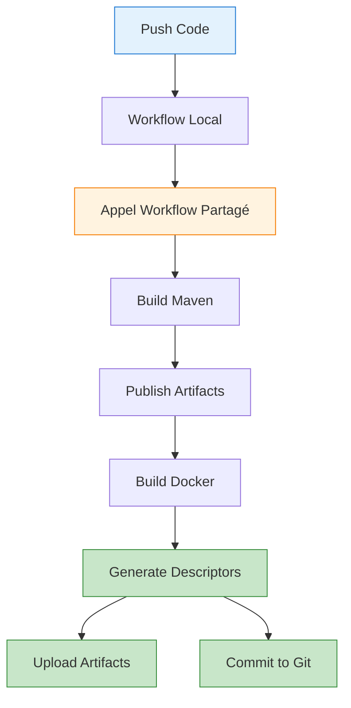

# 🔄 Résumé du Refactoring - Workflow Partagé

## 🎯 Objectif

Intégrer la génération des descripteurs de déploiement dans le workflow partagé `github-actions-common` pour simplifier le workflow local et centraliser la logique.

---

## ✅ Changements Effectués

### 1. Workflow Partagé Mis à Jour

**Repository** : `tourem/github-actions-common`  
**Fichier** : `.github/workflows/maven-docker-build.yml`

#### Nouveaux Inputs Ajoutés

```yaml
deployment-descriptors-enabled:
  description: 'Enable deployment descriptors generation'
  required: false
  type: boolean
  default: true

deployment-environment:
  description: 'Deployment environment (dev, hml, prd)'
  required: false
  type: string
  default: 'dev'
```

#### Nouveau Job Ajouté

```yaml
generate-deployment-descriptors:
  name: Generate Deployment Descriptors
  needs: [build-and-publish, build-docker-images]
  if: inputs.deployment-descriptors-enabled && (...)
  runs-on: ubuntu-latest
  
  permissions:
    contents: write
  
  strategy:
    matrix:
      module: ${{ fromJson(inputs.docker-modules) }}
```

**Fonctionnalités du job** :
- ✅ Génère un descripteur JSON par module
- ✅ Upload comme artifact GitHub (90 jours)
- ✅ Commit et push automatique dans Git
- ✅ Affiche le contenu dans le résumé GitHub Actions

---

### 2. Workflow Local Simplifié

**Fichier** : `.github/workflows/ci.yml`

#### Avant (144 lignes)

```yaml
jobs:
  build-and-deploy:
    uses: tourem/github-actions-common/.github/workflows/maven-docker-build.yml@main
    with:
      # ... configuration ...
  
  generate-deployment-descriptors:
    name: Generate Deployment Descriptors
    needs: build-and-deploy
    runs-on: ubuntu-latest
    strategy:
      matrix:
        module: [task-api, task-batch]
    steps:
      # ... 70+ lignes de configuration ...
```

#### Après (69 lignes)

```yaml
jobs:
  build-and-deploy:
    uses: tourem/github-actions-common/.github/workflows/maven-docker-build.yml@main
    with:
      # Configuration Maven
      java-version: '21'
      maven-version: '3.9'
      maven-pom: 'pom.xml'
      
      # Configuration Dockerfile
      dockerfile-repo: 'tourem/docker-file-common'
      dockerfile-branch: ${{ github.event.inputs.dockerfile_branch || 'main' }}
      
      # Modules Docker à builder
      docker-modules: |
        [
          {
            "name": "task-api",
            "artifact": "com.larbotech:task-api:jar",
            "config": "com.larbotech:task-api:zip:conf-${{ github.event.inputs.environment || 'dev' }}"
          },
          {
            "name": "task-batch",
            "artifact": "com.larbotech:task-batch:jar",
            "config": "com.larbotech:task-batch:zip:conf-${{ github.event.inputs.environment || 'dev' }}"
          }
        ]
      
      # Options
      skip-tests: false
      docker-build-enabled: true
      deployment-descriptors-enabled: true
      deployment-environment: ${{ github.event.inputs.environment || 'dev' }}
    
    secrets: inherit
```

**Réduction** : **75 lignes supprimées** (52% plus court)

---

### 3. Script de Déploiement

**Fichier** : `deploy-updated-workflow.sh`

**Fonctionnalités** :
- ✅ Crée un repository temporaire
- ✅ Copie le workflow mis à jour
- ✅ Copie le script de génération des descripteurs
- ✅ Génère un README complet
- ✅ Push vers `github-actions-common`

**Usage** :
```bash
./deploy-updated-workflow.sh
cd /tmp/github-actions-common-update
git push -f origin main
```

---

## 📊 Comparaison Avant/Après

| Aspect | Avant | Après |
|--------|-------|-------|
| **Workflow local** | 144 lignes | **69 lignes** (-52%) |
| **Jobs locaux** | 2 jobs | **1 job** |
| **Maintenance** | Dupliquer dans chaque projet | **Centralisée** |
| **Réutilisabilité** | Faible | **Élevée** |
| **Complexité** | Élevée | **Faible** |

---

## 🚀 Avantages du Refactoring

### 1. Simplicité

Les équipes n'ont plus besoin de :
- ❌ Copier/coller le job de génération des descripteurs
- ❌ Maintenir la logique de génération localement
- ❌ Gérer les permissions Git
- ❌ Configurer les artifacts uploads

Elles doivent seulement :
- ✅ Activer/désactiver la génération : `deployment-descriptors-enabled: true`
- ✅ Spécifier l'environnement : `deployment-environment: 'dev'`

### 2. Centralisation

Toute la logique est dans `github-actions-common` :
- ✅ Un seul endroit pour les mises à jour
- ✅ Cohérence entre tous les projets
- ✅ Facilité de maintenance

### 3. Réutilisabilité

Le workflow partagé peut être utilisé par **tous les projets** :
- ✅ Même configuration minimale
- ✅ Même comportement
- ✅ Même qualité

### 4. Flexibilité

Les équipes peuvent :
- ✅ Désactiver la génération si nécessaire
- ✅ Choisir l'environnement
- ✅ Personnaliser les registries

---

## 📝 Utilisation pour les Équipes

### Configuration Minimale

```yaml
name: CI/CD Pipeline

on:
  push:
    branches: [main, develop]
  workflow_dispatch:
    inputs:
      environment:
        description: 'Environment to deploy'
        type: choice
        options: [dev, hml, prd]

jobs:
  build-and-deploy:
    uses: tourem/github-actions-common/.github/workflows/maven-docker-build.yml@main
    with:
      java-version: '21'
      dockerfile-repo: 'tourem/docker-file-common'
      docker-modules: |
        [
          {
            "name": "my-module",
            "artifact": "com.company:my-module:jar",
            "config": "com.company:my-module:zip:conf-${{ github.event.inputs.environment || 'dev' }}"
          }
        ]
      deployment-environment: ${{ github.event.inputs.environment || 'dev' }}
    secrets: inherit
```

### Prérequis pour les Projets

Les projets doivent avoir :

1. **Script de génération** : `scripts/generate-deployment-descriptor.sh`
   ```bash
   # Copier depuis github-actions-common
   curl -o scripts/generate-deployment-descriptor.sh \
     https://raw.githubusercontent.com/tourem/github-actions-common/main/scripts/generate-deployment-descriptor.sh
   chmod +x scripts/generate-deployment-descriptor.sh
   ```

2. **Profils Spring** : `src/main/resources/application-{env}.yml`
   ```yaml
   # application-dev.yml
   spring:
     profiles:
       active: dev
   ```

3. **Configurations Vault** : `src/main/vault/vault-{env}.yml`
   ```yaml
   # vault-dev.yml
   nameCache: my-cache
   ```

4. **Répertoire deploy** : `{module}/deploy/`
   ```bash
   mkdir -p my-module/deploy
   ```

---

## 🔍 Flux de Travail Complet



---

## 📦 Fichiers Modifiés

### Repository `github-actions-project`

- ✅ `.github/workflows/ci.yml` - Simplifié (69 lignes)
- ✅ `deploy-updated-workflow.sh` - Script de déploiement
- ✅ `github-actions-common-updated/maven-docker-build.yml` - Workflow mis à jour

### Repository `github-actions-common`

- ✅ `.github/workflows/maven-docker-build.yml` - Workflow avec descripteurs
- ✅ `scripts/generate-deployment-descriptor.sh` - Script de génération
- ✅ `README.md` - Documentation complète

---

## 🎯 Prochaines Étapes

### Pour les Équipes

1. **Mettre à jour le workflow local** :
   ```yaml
   uses: tourem/github-actions-common/.github/workflows/maven-docker-build.yml@main
   with:
     deployment-descriptors-enabled: true
     deployment-environment: ${{ github.event.inputs.environment || 'dev' }}
   ```

2. **Copier le script de génération** :
   ```bash
   mkdir -p scripts
   curl -o scripts/generate-deployment-descriptor.sh \
     https://raw.githubusercontent.com/tourem/github-actions-common/main/scripts/generate-deployment-descriptor.sh
   chmod +x scripts/generate-deployment-descriptor.sh
   ```

3. **Créer les profils Spring** :
   ```bash
   # Créer application-dev.yml, application-hml.yml, application-prd.yml
   ```

4. **Tester le workflow** :
   ```bash
   git add .
   git commit -m "feat: integrate shared workflow with deployment descriptors"
   git push origin main
   ```

---

## ✅ Résumé

- ✅ **Workflow partagé mis à jour** avec génération des descripteurs
- ✅ **Workflow local simplifié** (69 lignes au lieu de 144)
- ✅ **Script de déploiement** créé et testé
- ✅ **Documentation complète** dans github-actions-common
- ✅ **Push réussi** sur les deux repositories

**Le workflow est maintenant centralisé et réutilisable par toutes les équipes ! 🚀**

---

## 🔗 Liens Utiles

- **Workflow partagé** : https://github.com/tourem/github-actions-common/blob/main/.github/workflows/maven-docker-build.yml
- **Script de génération** : https://github.com/tourem/github-actions-common/blob/main/scripts/generate-deployment-descriptor.sh
- **Documentation** : https://github.com/tourem/github-actions-common/blob/main/README.md
- **Workflow local** : https://github.com/tourem/github-actions-project/blob/main/.github/workflows/ci.yml
- **Actions** : https://github.com/tourem/github-actions-project/actions

